# FLY FUN — Travel Agency

## Group: IT-2502

## Members: Saida Kh., Karima M., Ainaz A.

FLY FUN is an educational travel agency website created for the Midterm Project. Visitors can learn about the agency, explore destinations, compare tour prices, and complete a demo booking form. The project focuses on travel and tourism, and the website interface is in English.

## Team Members and Individual Contributions

Our team has three members: **Karima, Saida, and Ainaz**. Responsibilities are assigned as follows:

| Team Member | Pages and Responsibilities |
| --- | --- |
| **Saida** | Home (`index.html`) and About (`about.html`): the hero section, destination cards, agency information, and guide profiles; the shared header and footer, Flexbox navigation, typography, and basic styling. |
| **Karima** | Tours (`tours.html`) and Contacts (`contacts.html`): the tour pricing table, booking form with labels and required fields, email validation, automatic tour selection, and a local booking request preview. |
| **Ainaz** | Gallery (`gallery.html`): the CSS Grid photo gallery and captions; tablet and mobile responsiveness, hover and focus effects, README documentation, and preparation for deployment. |

Each member should be able to explain the entire project, including the pages and code assigned to other members.

## Implemented Features

- Five pages with shared navigation and an active page indicator.
- Semantic HTML5 elements: `header`, `nav`, `main`, `section`, and `footer`.
- Destination cards using Bootstrap Grid and a separate photo gallery using CSS Grid.
- A comparison table for four tours, with horizontal scrolling on narrow screens and alternating rows using `:nth-child()`.
- A form with native HTML validation; each Book Now button automatically selects the corresponding tour.
- Responsive layouts with media queries at `767.98px` and `575.98px`, Flexbox, and CSS positioning.
- CSS variables, the Outfit font from Google Fonts, `:hover` effects, and visible keyboard focus.
- Lazy image loading with `loading="lazy"`.
- Contact details, a copyright notice, and external social platform links in the footer.

## Technologies Used

HTML5, CSS3, Bootstrap **5.3.3**, Google Fonts, and a small JavaScript file for the demo form. Bootstrap is included locally in `css/bootstrap.min.css`; all custom styles are in `css/style.css`. No build process or npm installation is required.

## Website Screenshots

These screenshots show the current project rendered locally in a browser.

### Home

The home page introduces FLY FUN and displays destination cards in a responsive Bootstrap layout.

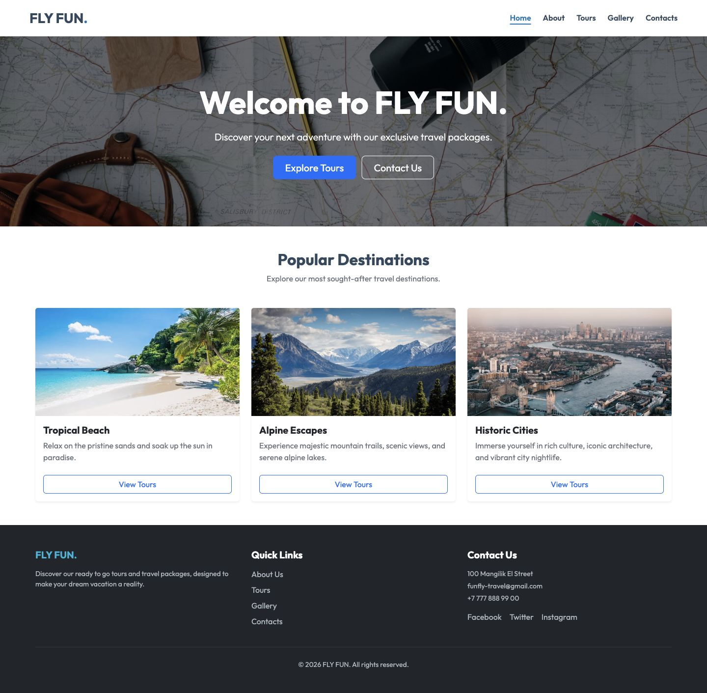

### About

The about page presents the agency, its mission, and guide profiles.

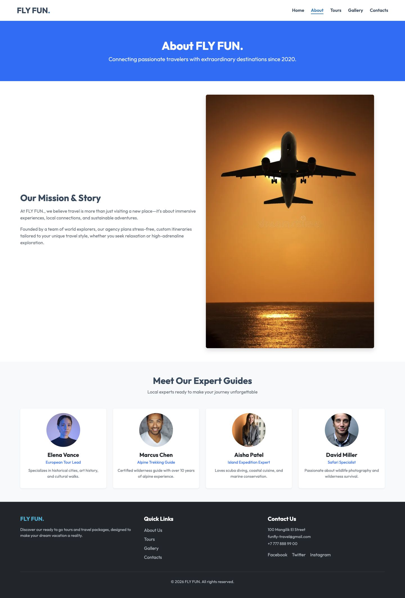

### Tours

The tours page compares four travel packages and links each Book Now button to the booking form.

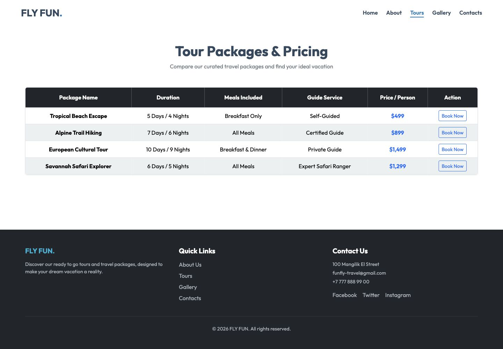

### Gallery

The gallery displays travel photographs and captions in a CSS Grid layout.

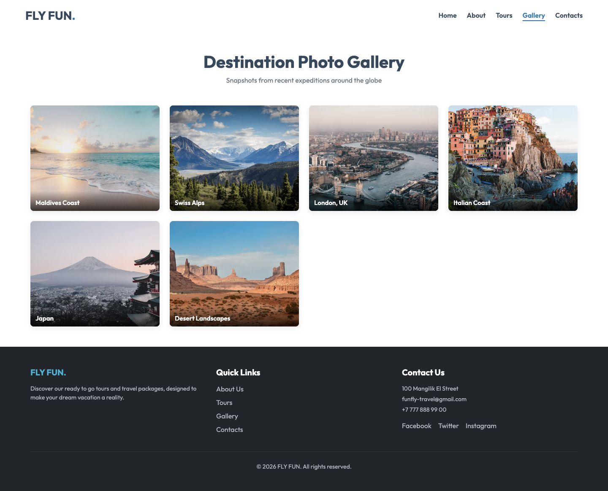

### Contacts

The contacts page contains the demo booking form with labeled fields and native HTML validation.

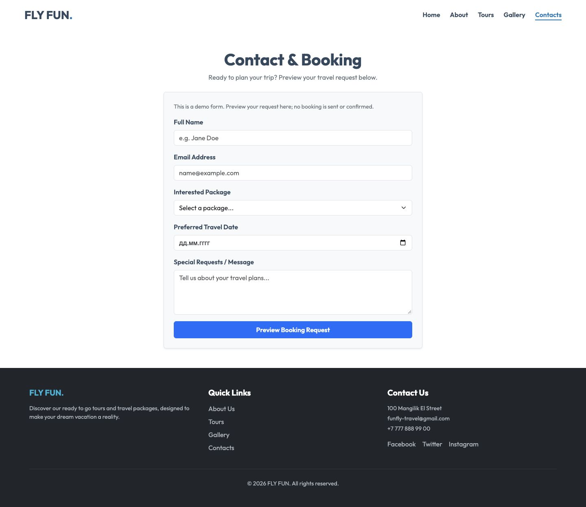

## Code Examples

The following screenshots show excerpts from the project source and their visible results.

### 1. Bootstrap Grid

In `index.html`, `col-12 col-md-6 col-lg-4` gives each destination card the full row on small screens, half the row on medium screens, and one third of the row on large screens. See the destination cards in the [Home screenshot](#home).

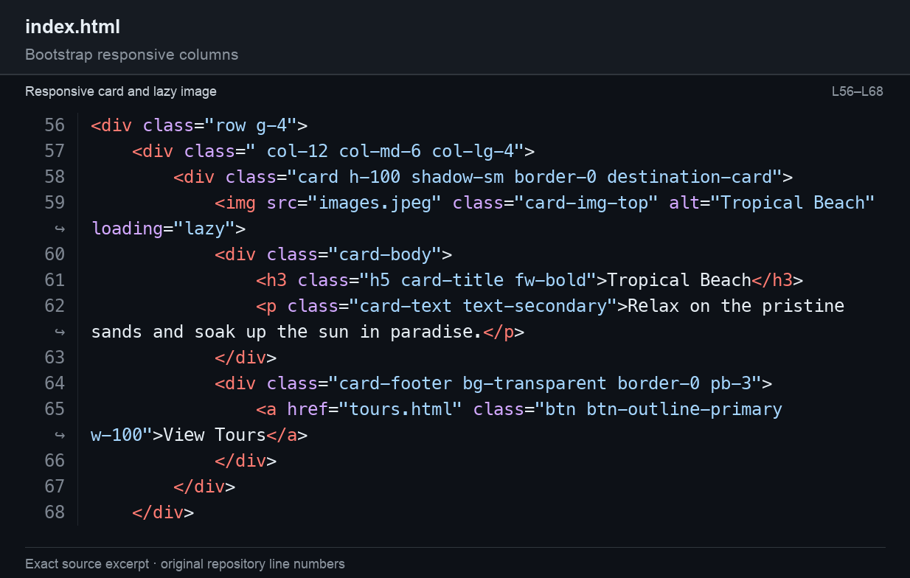

### 2. CSS Grid

In `css/style.css`, `.custom-gallery-grid` uses `repeat(auto-fit, minmax(280px, 1fr))` to arrange photographs in columns that fit the available space. See the [Gallery screenshot](#gallery).

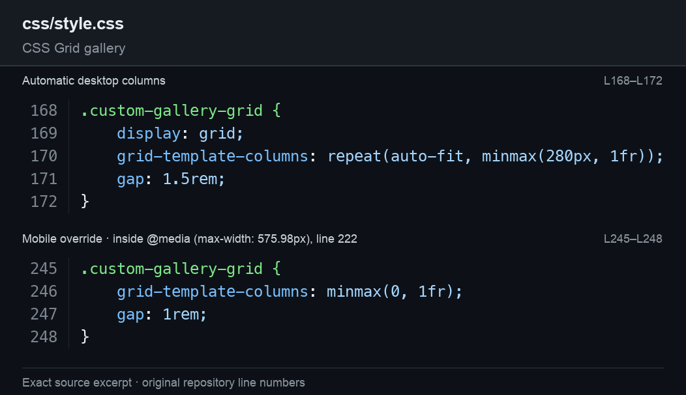

### 3. Flexbox Navigation

The header and `.nav-list` use Flexbox to align the logo and navigation links. The links can wrap when space is limited. See the header in the [Home screenshot](#home).

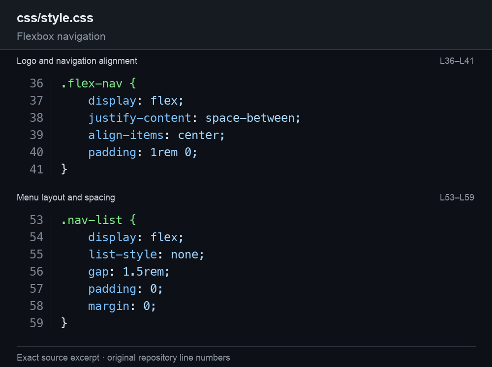

### 4. Alternating Table Rows

The selector `.custom-table tbody tr:nth-child(even) > *` applies a different background to every second table row, making the tour comparison easier to read. See the table in the [Tours screenshot](#tours).

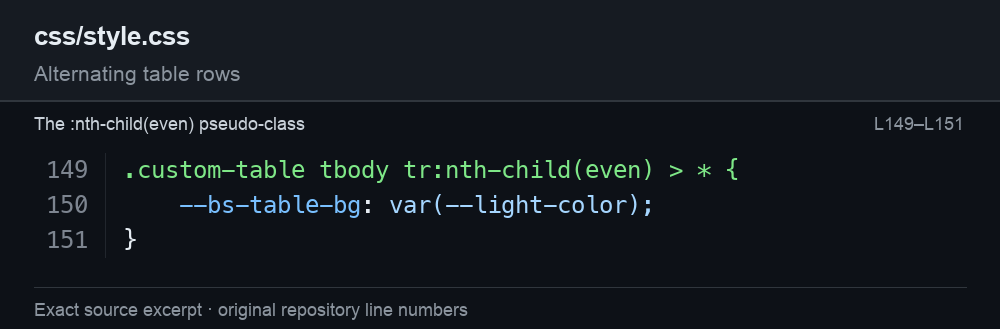

### 5. Visible Keyboard Focus

The `:focus-visible` rules add an outline to links and buttons during keyboard navigation.

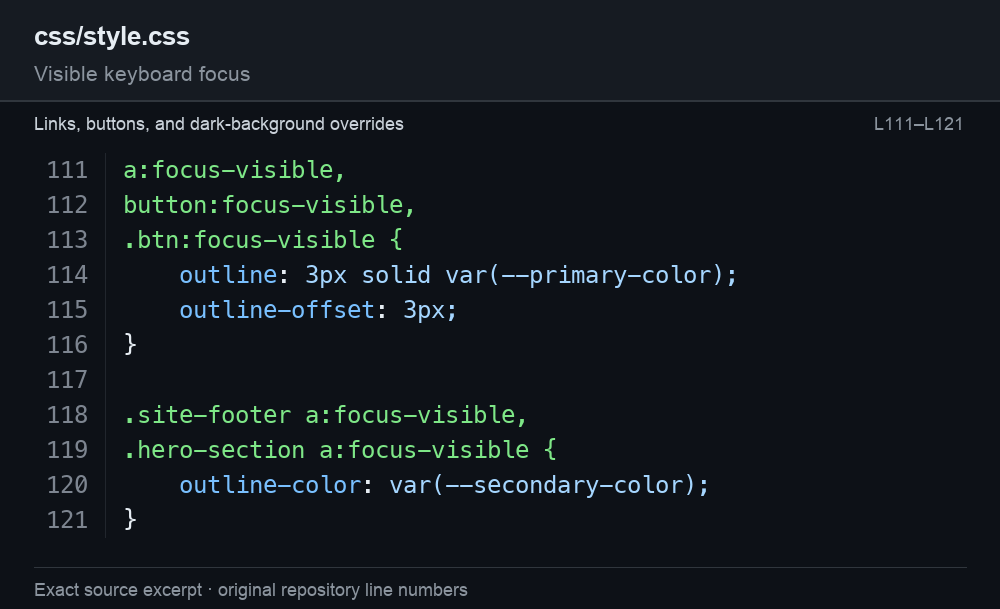

The booking form button below has keyboard focus.

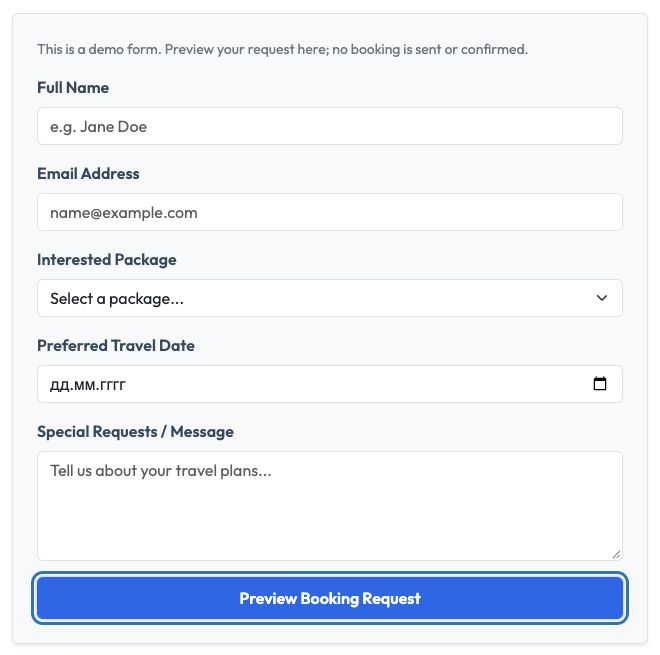

### 6. Responsive Layout

Media queries at `767.98px` and `575.98px` adjust the header, navigation, spacing, and gallery for smaller screens.

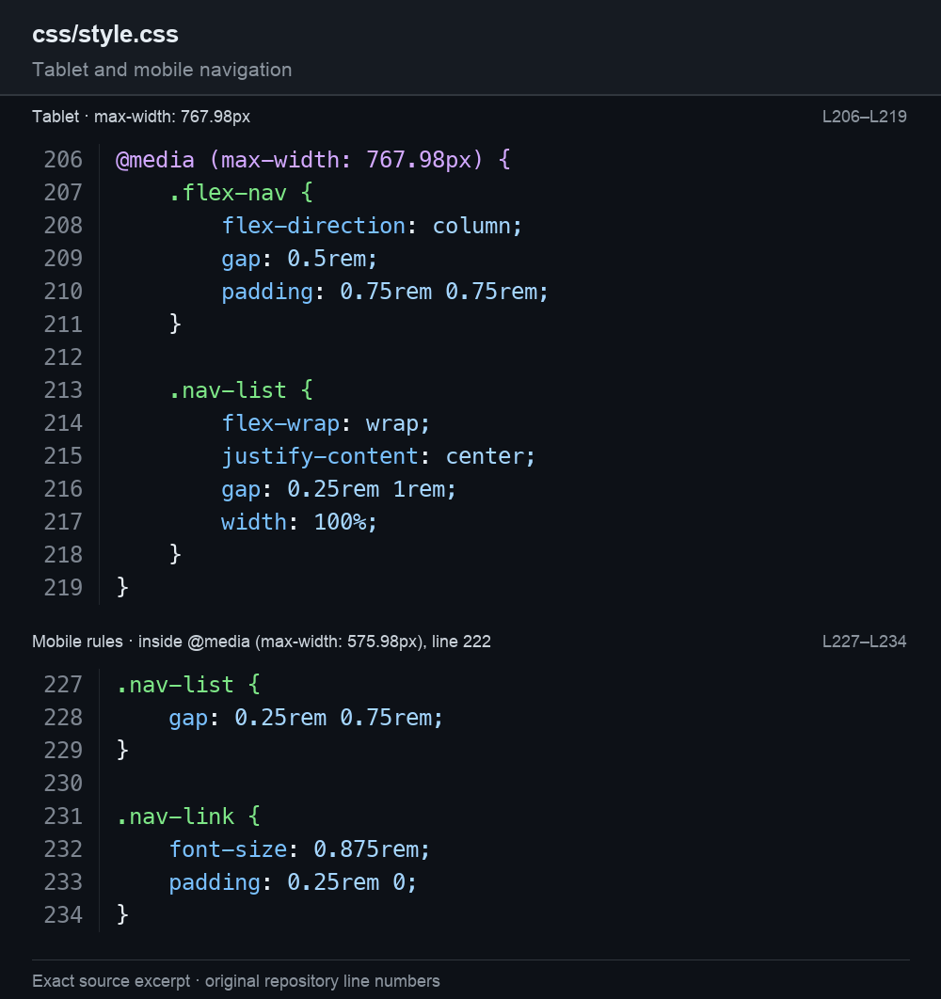

At a viewport width of **390 pixels**, the gallery uses a single column and the logo sits above the navigation menu.

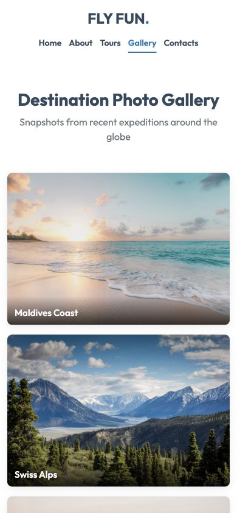

## How to Open

Open the live website: [FLY FUN](https://jkooked.github.io/midterm_web/).

Repository: [Jkooked/midterm_web](https://github.com/Jkooked/midterm_web).

## Demo Form

The booking form validates input and displays a local preview. It does not send requests, save submissions, or confirm bookings. Contact details are for demonstration purposes, and the social links lead to the platforms' homepages.
